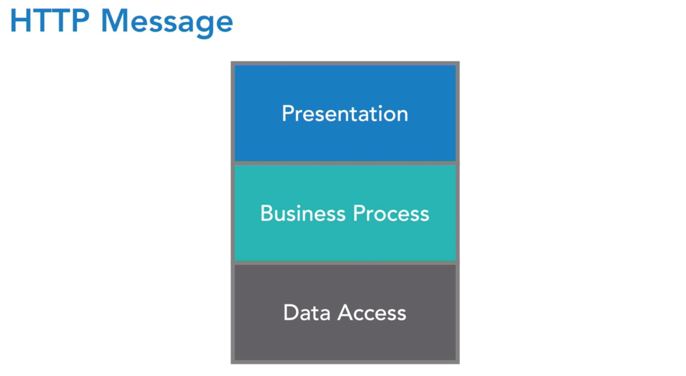
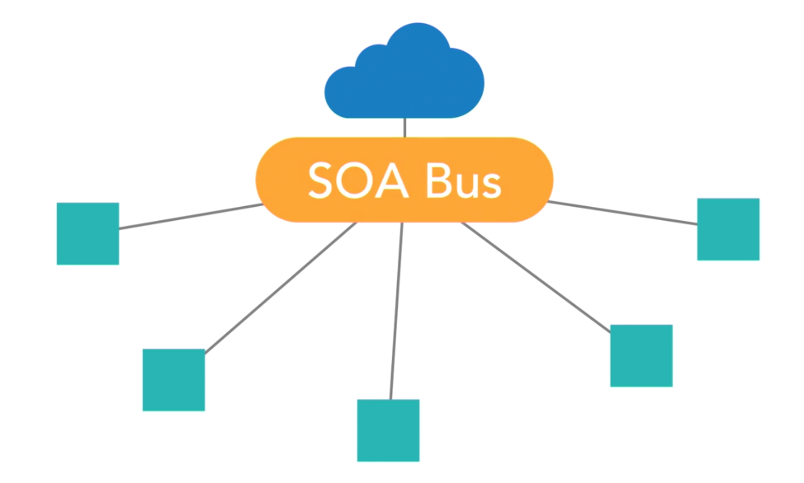
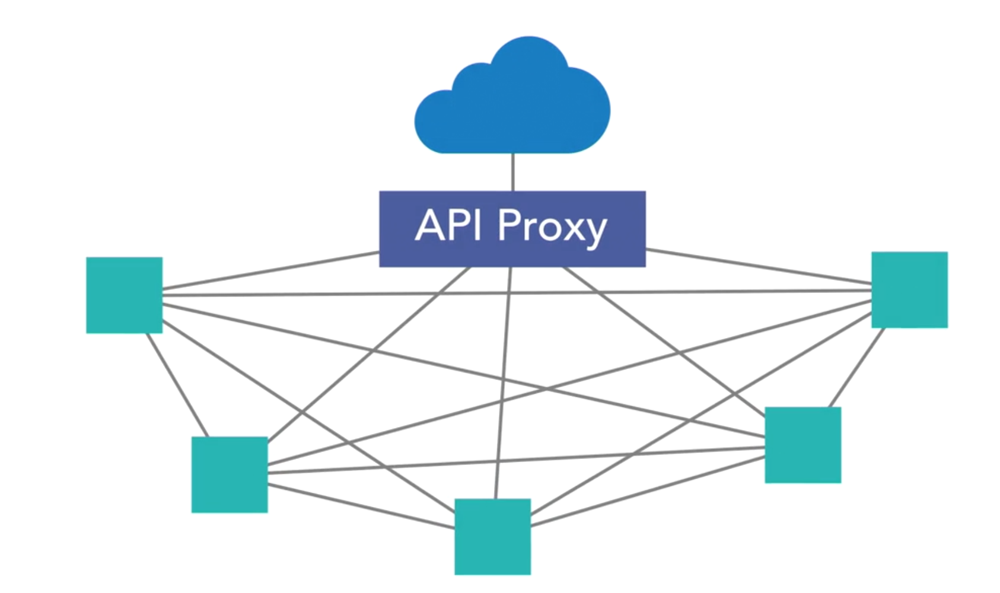
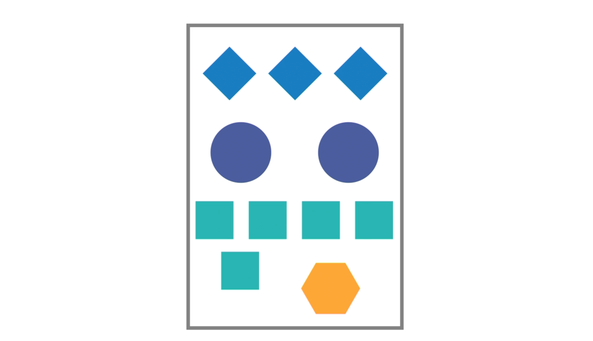

```{r, include=FALSE}
here::i_am("code/about.Rmd")
knitr::opts_chunk$set(error = FALSE,
                      message = FALSE,
                      warnings = FALSE,
                      echo = FALSE)
```

## History of service-based architectures

### Monolithic Applications 

```{r img 01, out.width="60%", fig.align="center"}

```

- Often build with three layers : Presentation - Business Process - Data Access

- Each layer would decompose into three layers : Facade - Processing - I/O

  - often over and over 
  
- The coupling of code in monolithic applications made changes difficult

  - older the app was the more coupling would develp
  
- mono. app.'s took a lot of time to build, test, and deploy

### Service-Oriented Architecture (SOA)

```{r img 02, out.width="60%", fig.align="center"}

```

- This decomposes app. into smaller models. 

- Two new issues : (1) web service tech. (2) aggrigation layer 

- added new layer of coupling between internal and external layers of the system as a whole. 

### Microservices 

```{r img 03, out.width="60%", fig.align="center"}

```

- more agile framework that can be extended into a cloud native world much easier than other architectures

- HTTP is at the heart of the model

## The monolithic application 

- two "types" of mono. app.'s

### Large EAR deployments 

```{r img 04, out.width="60%", fig.align="center"}

```

- everthing contained in one large artifact

- high coupling 

- must test the entire deployemnt for every bug fix 

  - impacts speed to market 
  
- agility and maintainability suffer

- difficult to scale 

## Services-orieted architecture

- provides a strong contarct and WSDL

- issues with deployment 

- another problem was that everything is an ok (200) or fault (500)

- once application was build applications would be wired through buisness processing (BPO)  

  - once BPO got bigger so did the coupling of systems
  
  - wiring became just as much apart of the trational codebase
  
  - wiring was often hiden from dev.'s
  
  - this would cause spagetti code, painful deployments, and fragile systems 
  
  - restricted agility 
  
- difficult to manage services and wiring in seperate codebases

- high cost associated with these systems

## Microservices: The new kid on the block 

- at core microsercives are about decomposing system into more discrete units of work 

- making architecture at a component level work the way good development practices do with moderlirization of code itself.  

  - break down problem into smaller problem and solve these problems in a smaller decoupled way 
  
- microservices embraces concept where different protocol aware systems are able to exhange infomation 

- each unit of work can be called from any other unit of work in the system. 

- microservices are cheap and can be done with open source software

## Microservices: Solver of problems but not the silver bullet

- biggest price to pay is complexity 

  - deployment 
  
  - determining where code lives
  
- need to update processes 

- "distribution tax" 

  - increase in network comunication between services 
  
  - the increase in call volume can risk congestion 
  
  - a slow call can cause thread blocking 
  
  - teams will move to reactive tech. to alleviate single thread blocking calls
  
- reduction of reliability 

  - the more moving part in system there is a decrease in overall reliability of system
  
  - if a system is sick the impact can extend to mulitple client calls

## Microservices and cloud native

- cloud native arch. are based loosly on building app.'s according to twelve factor methodologies. 

- Cloud Infrastructure : public cloud, private cloud, hybrid cloud 

- every microservice today is aimed at delivering to a cloud-native platform

  - smooth transition into a twelve factor application 
  
- you can build microservice not capable to moving to the cloud

- Cloud-Native Microservice-Based
  
  - Single code base (12 factor)
  
  - completely self-contained
  
  - zero file system usage (req. migration)
