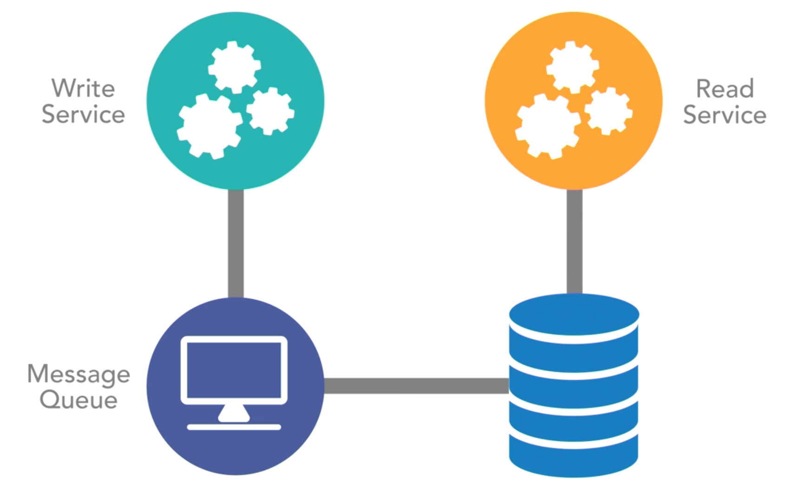
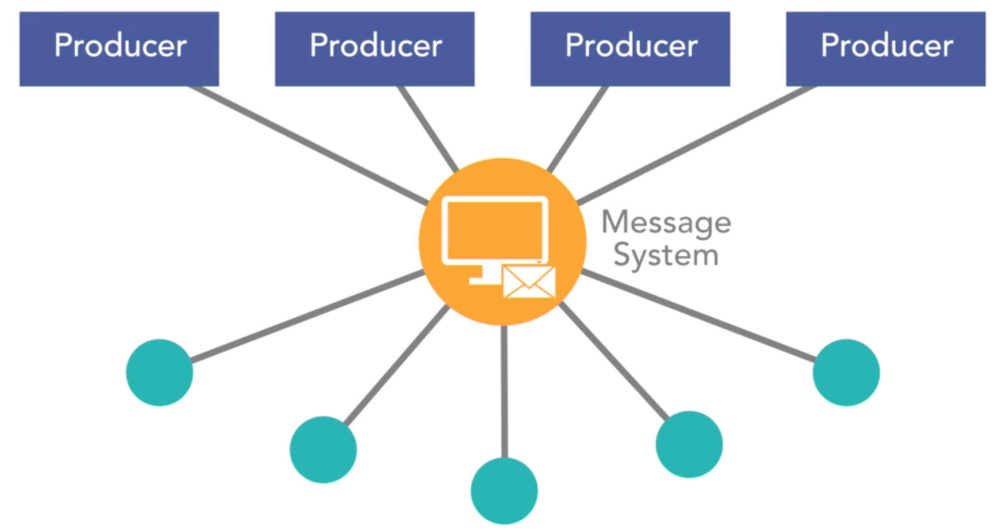
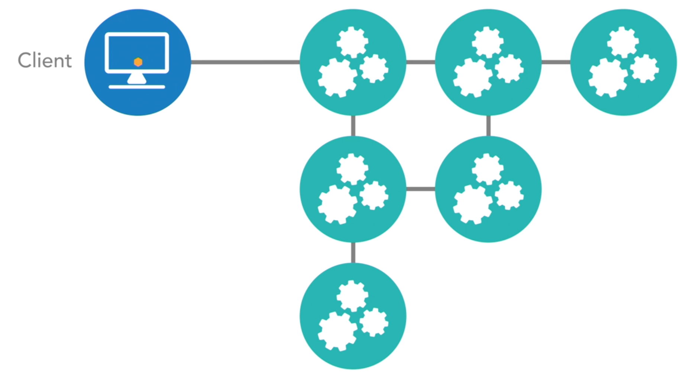
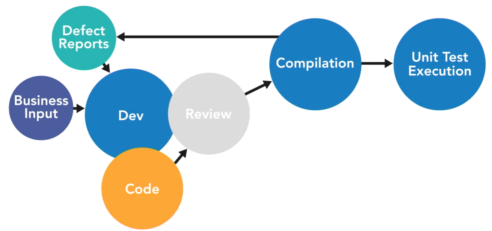
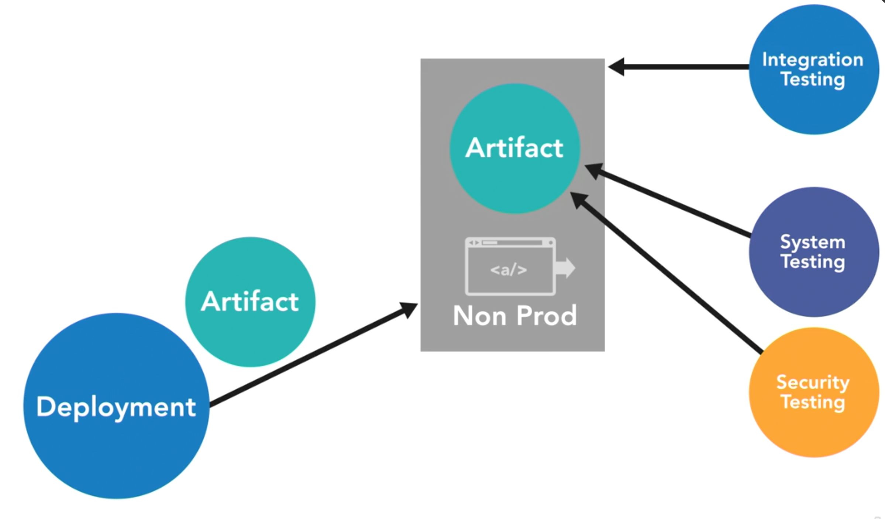
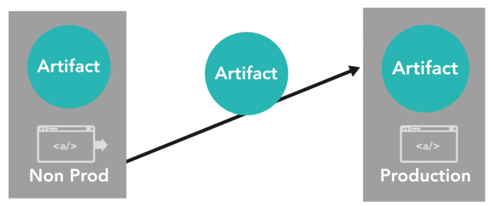
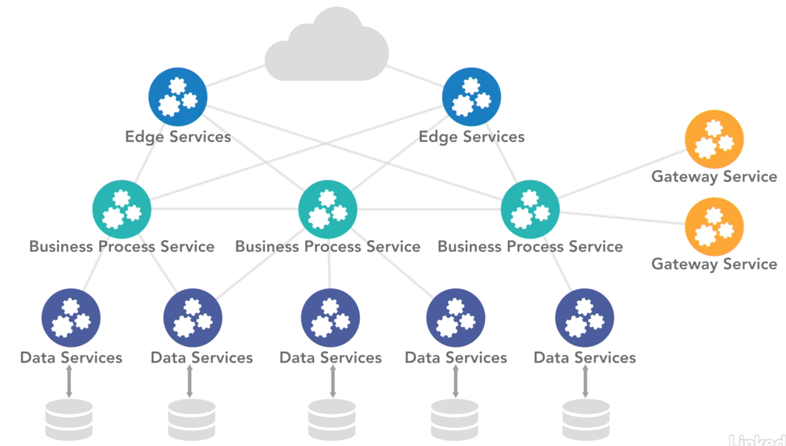
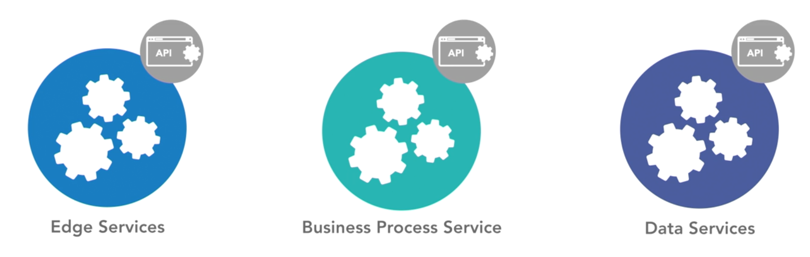
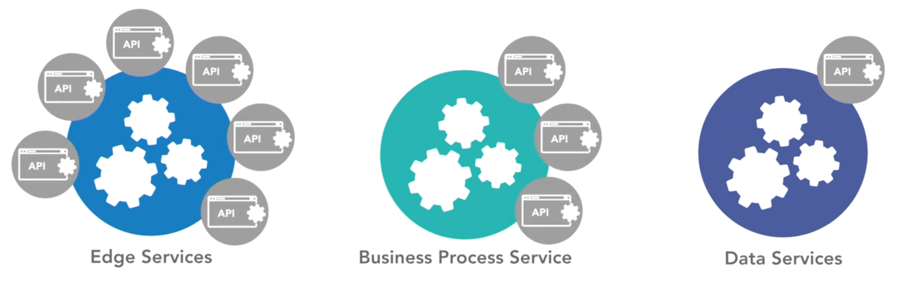

```{r, include=FALSE}
here::i_am("code/advanced_concepts.Rmd")
knitr::opts_chunk$set(error = FALSE,
                      message = FALSE,
                      warnings = FALSE,
                      echo = FALSE)
```

## Asynchronous communications

The key to reducing latency is to rely on event driven asynchronous communication.

- this will improve system health and support long term objectives of moving large amounts of data over long distances in a timely fashion 

Learning how to handle and respond to error conditions is critical to keeping the system healthy. 

### Example 

```{r img 10, out.width="60%", fig.align="center"}

```

Services put message into an asynchronous message broker or temporary data store, and then drive events from this new state. The downstream event processors will process the data and eventually cause the data to be stored in its final data store. Conversions will then occur through either distributed patterns or subsequent event processing. 

### Example Stream Data Platforms

```{r img 11, out.width="60%", fig.align="center"}

```

Events are written by producers to a central message broker. These events then trigger listener operations that take action on that data if it applies to them. These events can trigger operations that format the data, cause other downstream events, or various other activities 

- useful for largly distributed systems because often events trigger multiple operations and not just one 

- can do more work with less overall stress on the system

- improves overal performance in activities like logging, auditing, or inspections

### Goal

Load reduction

- want immediate results, but not everything has to be done in that moment 

- some of the processes can be deferred 

Take care to handle error states correctly

- if messages cannot be processed for any reason you cannot ignore them. 

- Dead letter queues must be monitored, and action must be taken to process the messages, even if it's manual processing 

- Data should be routinely monitored for correctness in an automated fashion. 

- Performance must be evaluated to ensure that message brokers aren't getting behind 

## Logging and tracing in a microservices architecture

Evaulating call chains and aggregating logging associated to those call chains can be one of the hardest operation problems to solve 

When an issue arrives in can be difficult to see all of the moving parts

- your calls span multiple virtual machines or containers, and seperate sessions 

**Plan for unified logging strategies across your entire platform.**

### Unified topics to plan for 

1. Logging 

Having quality logging through out your API calls

- Day-to-day operations 

- troubleshooting 

- maintenance 

- investigations

- general tasks

Logging can be more challenging in a microservices enviroment

- lager volume of artifacts

- agile nature

- different teams - different logging strategies 

As you move to a distributed system there's an increased need to have some sort of convergence in your logging behaviors 

Might find yourself moving from traditional file logging, to log aggregations 

```{r img 12, out.width="60%", fig.align="center"}

```

Logging in a distributed environment helps to determine the actual flow through the system and not just one service, by a process called tracing

Tracing using a unique token, called a trace. Each services uses the token and then passes it downstream to all of the service calls it makes. Each of those then do the same

- trace id exists in all of log messaging in all services throughout the system, for a given call stack 

-  aggregate a set of call messages and timings to look at a set of call metrics and behaviors 

## Continuous delivery as a requirement

- small artifacts make development easier, but can make deployments more difficult

- goal is to keep dev. teams agile

### Continuous Delivery 

- has many moving parts

- improves success 

### CICD Pipeline 

(Continuous Integration and Continuous Delivery)

```{r img 13, out.width="60%", fig.align="center", fig.cap="Build Step"}

```

- the build step often compiles and executes unit tests to ensure the code is ready for future deployment

```{r img 14, out.width="60%", fig.align="center", fig.cap="automated deployment to a non. production enviroment"}

```

- has run-time that mimics production, but does not take production traffic 

- see integration, system testing, and security testing here 

- automating as much as possible 

```{r img 15, out.width="60%", fig.align="center", fig.cap="Moved to Production"}

```

- deployed to production through routing techniques or Blue-green deployments

**Continuous deliver is required to achieve agility in a microservices architecture.**

- automate automate automate 

- start small : focus on building, deploying, and basic testing. 

- consider integration into your ticketing system, chat system, other testing frameworks, and systems.

- advanced automation includes things like self-registering your deployment with monitoring or routing systems. 

## Hybrid architectures: Hierarchy and service-based 

- the unknown unknown can be difficult to wrap into a road map. 

- difficult prolems to solve such as : database segmentation and service boundaries

### Hierarchical Srvice Architecture

- many thoughts leaders are opposed to this model

- previous circular dependencies 

- models in n-tier architecture via services instead of modules

```{r img 16, out.width="60%", fig.align="center", fig.cap="n-tier hierarchy model"}

```

- in the n-tier you may define a few different classes of services

-  a common class is data service that exposes data domain-specific 

- another class is business process services that defines high level business processes that are well defined. 

- gateway services build abstractions to external dependencies. 

- edge services expose data and business processes.

- once there are clear classifications built with what each of these tasks and services do then you can build out rules about what services can consume. 

- look at risks of circular call tree and make a rule that no data service can consume another dat service without being involved in a business process. 

  - this may seem like an easy way to prevent issues, but this also comes with risks: 
  
      - need to adjust logic and flow through the system to accommodate your artificially imposed rules 
      
      - may find self building and defining business processes that don't really exist. 
      
- take this hybrid model lightly, and only consider it as a transition method 

### Serivce-Based Architecture

- single underlying database 

- leverages services to handle decomposition

- gains some agility without modifications to datastores

```{r img 17, out.width="60%", fig.align="center"}

```

- a great starting point, but can lead to monolith of monolith system

```{r img 18, out.width="60%", fig.align="center"}

```

- when service offerings extend beyond the original scope because you don't have well defined domains you end up hurting yourself in the long run


