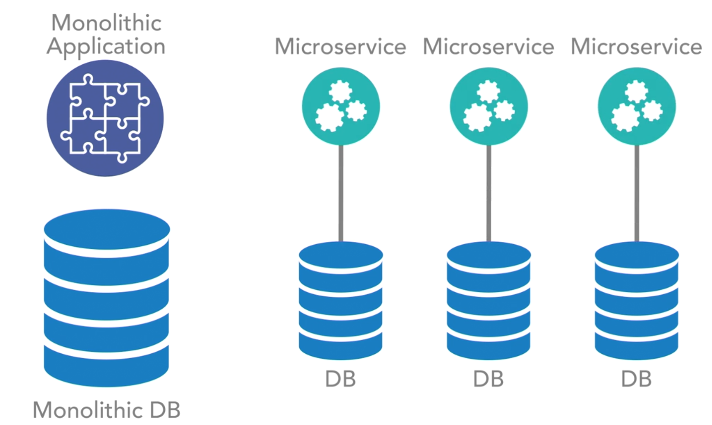
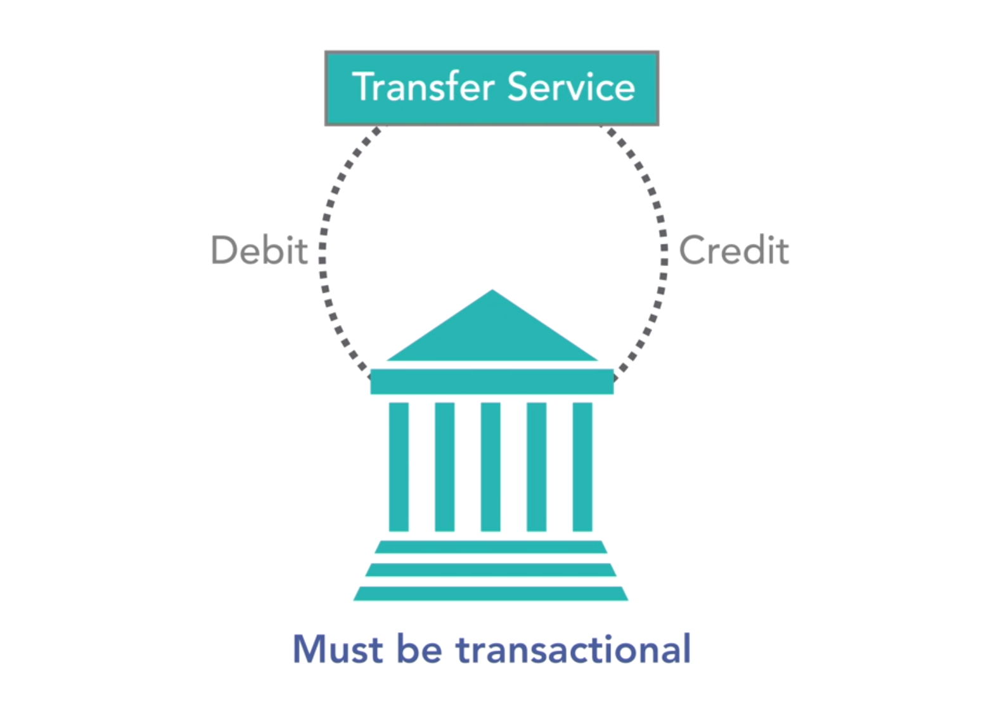

```{r, include=FALSE}
here::i_am("code/core_concepts.Rmd")
knitr::opts_chunk$set(error = FALSE,
                      message = FALSE,
                      warnings = FALSE,
                      echo = FALSE)
```

## The Services

- not about the size, but operation of the service that matters

- microservices communicates by leveraging ReST over HTTP 

  - powerful for large orginizations

  - each team can build services as they see fit, as long as the services are exposed to ReST

  - $\Rightarrow$ each team can use those services because they all communicate in a common way 
  
- need to unify service documentation because there is no standard way to document ReST doc.'s

- a microservies handles one set of related functions with little to no cross domain operations

- operations are defined on the domain as a whole. 

  - should provide low level data focuesed services in a microservice arch. that expost domain-specific CRUD operations on the domain object. 
  
  - that domain can span multiple data object. 
  
  - build a service that handles a set of related buisness processes that handle one or more domains 
  
- Service Design Anti-Pattern : (1) too fine grained (2) not fine grained enough 

- Dont be afraid to refactor.

- Size of services affects ability to experiment. 

- Smalller services build faster, have few test scenarios, and deploy and start much quicker. 

  - easier to experiment / make / fix mistakes. 

## The communication dance

All communications between individual services in a microservices arch. is over HTTP using ReST based services. 

Allows for the use of any coding language or framework that supports ReSTful services. 

Each service can consume any otehr service over the same communication strategy (PAHI). 

### Protocol-Aware Heterogenous Interoperability (PAHI)

Servies are bound to a protocol and execute communication over that protocol in a way that works in a mixed, or heterogeneous, environment. 

- Dev team will have many different skillsets: 
  
  - Backend : C# Java
  
  - Frontend : NodeJS
  
  - Data Science : Python 
  
- Each team can expose their services in the language they know by leveraging ReST

Problems can arise from all of these network calls, as each service can call any other service. 

There is no clear delineation of who is calling the you, so you must have a solid versioning strategy or maintain perfectly passive API's to prevent calling systems from failing when you release an updated version of your API.

- stay focused on this issue from day 1.

- rec. : a solid version and strategy, along with strong with strong passivity rules, to prevent this from becoming a major concern in your system. 

- enhance knowledge of this dance. 

## Distribution and scale

Each service is accessed over remote network call, regardless of being in a local or remote data center. Therefore you can theoretically move the service anywhere. In reality this is costly. 

Microservice solves the problem of getting infrastructure and services globally available, when needed, without making all systems gloablly avaiable. 

### Enterprise and Internet Needs

- Customer-facing applications

- Business-facing applications 

- All for day 2 growth from day 1

To scale, a microservice architecture allows you to increase the number of instances of you customer service when you experience a high user load.  

### Traditional Strategy of Monoliths

- Scale for the busiest day every day 

## The dangers of latency and gridlock

- While calls are waiting for responses the wait time can become unbearable and cause a failure of the entire system. 

- A call stack can become circular when a calling service is subsequently called by some downstream service. 

-  you must spend time trying to figure out gridlock and latecy 

  - one pattern is to use circuit breaker within your code, meaning you build a standard flow through your application and when latency rears its ugly head, and time outs start occuring you then trip the circuit and execute a default behavior. 
  
  - this may reduce functionally, but help prevent complete failure. 
  
- For example: netflix would still work even if their search bar didn't. 

### To help alleviate issures

- Need a strong timeout logic throughout system. 

- global distribution of all service offerings 

- scaling of individual services under load

- levering patterns like circuit breaker 

## Bounded context

### Core Concepts 

- investigae working systems

- determine the domains (boundries and inner worings)

- break services up accordingly 

Analyze the traffic patterns in your code based on real-world use cases of your system. 

Goal is to reduce cross-domain calls where appropriate. 

Latency is a pain point for microservices. There is no need to add extra calls when they make no sense. 

Strong contracts and well-defined boundaries allow for self-discovery. 

## Data domains as a service boundary

In the data layer you have to take more into context than simply the bounded context of your domain because you now have to deal with data transactions. 

### Transactional Boundaries

- cannot eliminate transactions completely 

- no distributed transactions

- new ways of thinking are needed

Building data domains for low-level services is one of the hardest parts of a microservices architecture

- involves decomposing a monolithic database into smaller individual systems. 

### Tackle Problem

(1) : Break up Monolithic DB into smaller DB and assing each of those DBs a microservice. 

```{r img 05, out.width="60%", fig.align="center"}

```

- migrating data can be significantly harder in a live system than building services expecially if you leverage an API layer for those services

(2) Start with the services instead of the database. 

```{r img 06, out.width="60%", fig.align="center"}
knitr::include_graphics("../img/img_06.png")
```

Main objective is to minimize cross domain calls, enforce your needed transaction boundaries, and then you can start decomposing your database into smaller instances. 

Data domains can become a large source of pain, and focus on most efficent systems for operation. 

## No ACID, only BASE

### ACID

Atomic: Either succeeds completely or fails completely. 

Consistent : Constraints of underlying datastore are enfored. 

Isolated : Cannot be read by other transactions until in a specific state based on isolation rules. 

Durable : Once saved, guaranteed to be in the datastore until modified. 

These only work in monolithic application. 

- painful in SOA model 

- don't exist in microservice model they don't exist 

Microservices strives for BASE insteaad of ACID. 

ACID allows you complete control. 

### BASE

Basically Available Soft state Eventually consistent

Strive for eventual consistency, and to achieve the end state in all nodes of the distributed datastore. 

Microservices architecture requires you to identify where you need ACID transactions and wrap service boundaries around those operations. 

- warning to evaluate if you really need ACID transactions 

### Bank Software Example 

```{r img 07, out.width="60%", fig.align="center"}

```

In a Debit / Credit transaction use case you will need to model your domain and services to continue to allow these transactions to be atomic. 

Applying for a loan has some level of asynchronous operation that can benefit from a form of eventual consistency. 

There are wayas to desing a system for eventual consistency including appropriate role backs that will help you in this process. 

## The API layer

Warning : If your API is doing transformations or executing logic, you're doing it wrong. You will have similar problems to those using SOA. 

API layer is of critical importance. 

In a microservices architecture an API layer is nothing more than an aggregated proxy of all of your service offerings.

An API layer is used to shield the outside world from knowing the structure, organization, or even what exact service is exposing a specific operation. 

It provides a standardized proxy interface that will expose whatever endpoints and API operations we configure it to expose. 

The API layer is a pure proxy. 

```{r img 08 and 09, out.width="60%", fig.align="center"}


```

A passive API is a passive API - no exceptions. 
